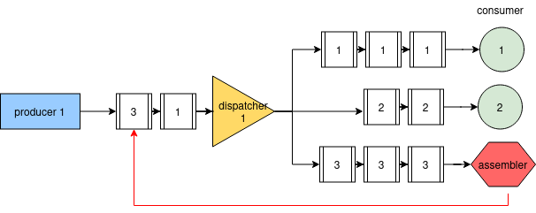

# Enunciado

Modifique el código de la simulación de red para introducir pérdida de paquetes. Reciba un parámetro más en línea de comandos que corresponde a la probabilidad de perder paquetes, como un porcentaje en precisión flotante. Implemente un hilo ensamblador que es uno de los destinos del repartidor, como se ve en el siguiente diseño de flujo de datos.



Por cada paquete que este hilo ensamblador recibe, se genera un número flotante pseudoaleatorio entre 0 y 100. Si este número generado es menor que la probabilidad de pérdida de paquetes, el hilo descarta el paquete, de lo contrario, modifica al azar el destino del paquete, y lo pone de regreso en la cola entre el productor y el repartidor.

Tome en cuenta que el hilo ensamblador que extravía paquetes no es parte de la cantidad de consumidores. El siguiente podría ser un ejemplo de ejecución con dos consumidores, y un ensamlador que extravía aproximadamente la mitad de los paquetes que recibe. La otra mitad son redirigidos a los dos consumidores.

````
bin/network_simul_packet_loss 1000 2 1 -2 0 50
Info	Producer	1000 messages sent
Info	Consumer	416 messages consumed
Info	Consumer	404 messages consumed
Info	Assembler	180 messages lost
````
