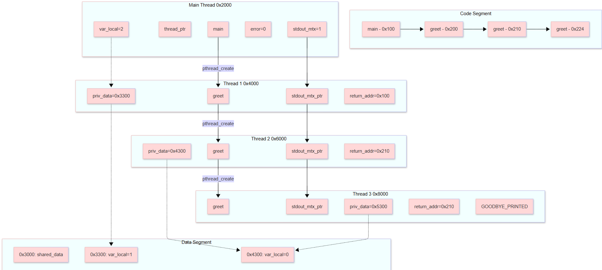

# Enunciado

Copie su ejemplos/pthreads/hello a ejercicios/pthreads/recursive_hello. Puede renombrar ejercicios/pthreads/recursive_hello/src/hello.c a recursive_hello.c o si lo prefiere, main.c.  

Modifique a greet() para recibir un número de tipo size_t. Si este número es 0, greet() imprime una despedida y el número recibido. Luego termina su ejecución.  

Si el número que greet() recibe es mayor que cero, imprime un saludo y el número recibido. Luego crea un hilo para que invoque a greet() pero con un número menor que el recibido por parámetro.  

Modifique el procedimiento main() para crear una variable local de tipo size_t inicializada en 2. Envíe este número como parámetro de la subrutina greet() que correrá en el hilo secundario.  

Recuerde copiar este enunciado en una sección de su documento de análisis ejercicios/pthreads/recursive_hello/readme.md y darle el formato apropiado. En otra sección haga una predicción de la salida de su programa antes de corerlo. Compílelo y córralo con el Makefile. Copie la salida de su programa y péguela en un bloque de código debajo de su predicción. Indique si acertó o no la predicción.

# Predicción de Salida
 
 Va a imprimir:  
 Hello from main thread  
 Hello from another thread  
 Hello from another thread  
 Goodbye from second thread  

 Porque va a entrar al segundo hilo, pero como no es cero, se hace un hilo nuevo. En el hilo nuevo entra al segundo hilo de nuevo, pero con el número 1. Como tampoco es 0, vuelve a crear un hilo, pero esta vez con el número 0, por eso vuelve al segundo hilo, y se termina el programa.

# Salida
Hello from main thread. Counter: 2  
No es cero. Creando otro hilo.  
Hello from another thread. Counter: 1  
No es cero. Creando otro hilo.  
Hello from another thread. Counter: 0  
Goodbye. Counter: 0  

Sí se acerté la predicción. Sin embargo, me costó imprimir un t_size que se hace con un '%zu' y al final ponerle la variable a imprimir. También me costó compilar y ejecutar el programa, que se hace estando la terminal en la carpeta 'recursive_hello', ejecutar 'make', luego moverse a bin, y ejecutar './recursive_hello'.

# Diagrama de Rastreo de Memoria
Hecho en MermaidChart

