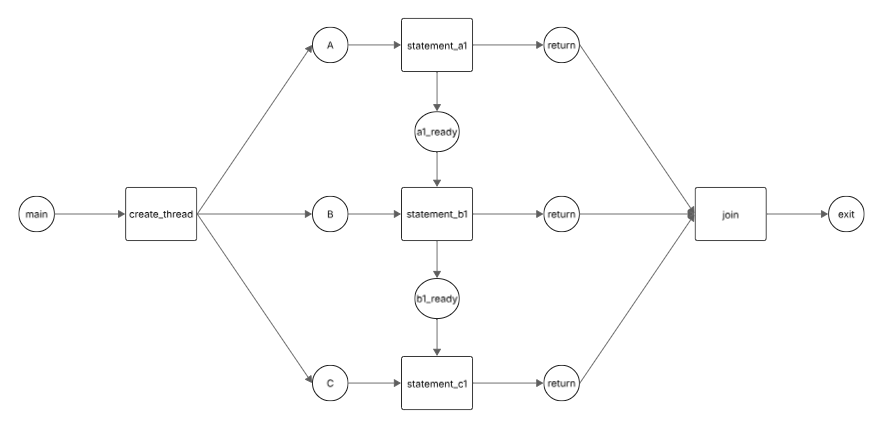

# Enunciado
Modifique los códigos de los hilos para que la instrucción a1 se ejecute siempre antes que la instrucción b1 y ésta siempre se ejecute antes que la instrucción c1. Este orden de ejecución puede abreviarse como a1 < b1 < c1. Actualice la red de Petri para que el aviso se dé entre los tres hilos.

`````
procedure main()
  create_thread(thread_a)
  create_thread(thread_b)
  create_thread(thread_c)
end procedure

procedure thread_a()
  statement a1
end procedure

procedure thread_b()
  statement b1
end procedure

procedure thread_c()
  statement c1
end procedure
`````

# Red de petri


# Pseudocódigo actualizado
````
procedure main()
    shared a1_ready := create_semaphore(0) // can_run_b1
    shared b1_ready := create_semaphore(0) // can_run_c1
    create_thread(thread_a)
    create_thread(thread_b)
    create_thread(thread_c)
end procedure

procedure thread_a()
    statement a1
    signal(a1_ready)
end procedure

procedure thread_b()
    wait(a1_ready)
    statement b1
    signal(b1_ready)
end procedure

procedure thread_c()
    wait(b1_ready)
    statement c1
end procedure
````