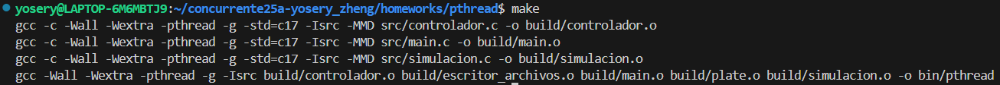
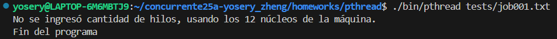
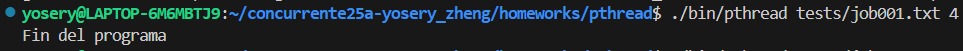
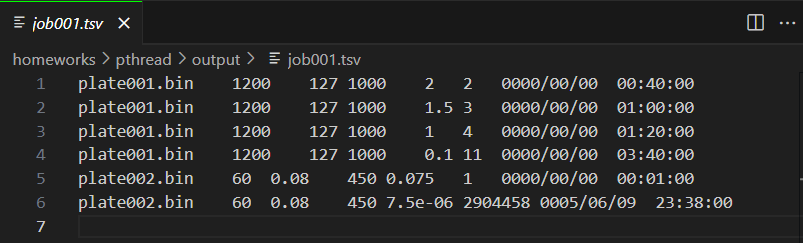
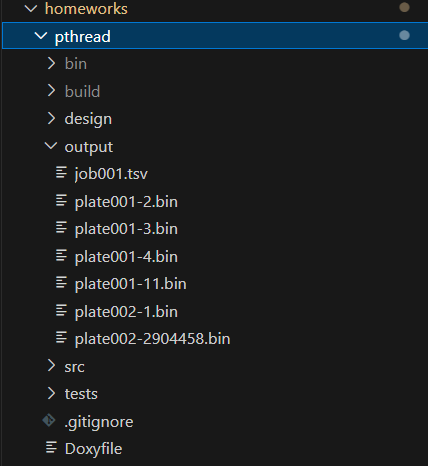

# Descripción
El presente programa simula la dispersión del calor de una lámina rectangular a la que le inyectan calor constante por los bordes. Cada lámina tiene celdas con diferentes temperaturas y entre celdas vecinas se transfieren calor. El propósito del programa es encontrar cuándo y cómo quedan las temperaturas de cada celda una vez se estabiliza la temperatura de la lámina entera.

Para empezar, el programa lee un archivo job###.txt y la cantidad de hilos que el usuario quiere usar. Si el usuario no ingresa la cantidad de hilos a utilizar, el programa usa la cantidad de núcleos que tiene la computadora.

El archivo txt contiene en orden el nombre del archivo de la lámina, el tiempo que dura para un cambio de temperatura, la difusividad térmica de la lámina, el tamaño de cada celda de la lámina, y el punto de equilibrio para la simulación. Una vez se carga toda la información del job, se procede a leer los archivos plate###.bin que indica el job.

El archivo plate###.bin está en binario, donde los primeros ocho bits son el número de filas de la lámina, y los próximos ocho bits son el número de columnas. Después, en orden, están las temperaturas de cada celda de la lámina. El programa lee el archivo plate###.bin y carga la información a una matriz.

En la simulación, se usa una fórmula de relación para calcular el cambio de temperatura de cada celda. Para aprovechar la concurrencia, se usa OMP para dividir cada línea del archivo txt en un hilo. Se usa una distribución dinámica.

Las salidas del programa son los plate###-k.bin, actualizadas con su nueva temperatura, siendo k la cantidad de iteraciones necesarias para que la temperatura de la lámina quede en equilibrio. También un archivo job###.tsv, que contiene la información original además de las iteraciones y el tiempo transcurrido hasta que se detuvo la simulación.

# Manual de Uso

### 0. Requisitos
- Tener un compilador para C, preferiblemente GCC.
- Estar en un entorno Linux.

### 1. Instalar el programa
Descargar la carpeta `omp_mpi` que se encuentra en el directorio `concurrente25a-yosery_zheng/homeworks`. Para clonar el repositorio entero, puede usar el comando `git clone https://github.com/cerillo2808/concurrente25a-yosery_zheng.git`

### 2. Compilar el programa
Posicionarse en el directorio `../omp_mpi/omp` y ejecutar el comando `make`.

### 3. Input (Entrada del programa)
El programa necesita de un archivo .txt que especifique los archivos binarios que contienen las láminas a procesar, mismas que deben ser provistas también. Dentro del código fuente se encontrará que el archivo .txt es referido como `job###.txt` y las láminas como `plate###.bin`.

Ejemplo de una entrada:
````
./bin/mpi tests/job001b/job001.txt 4
````
Siendo 4 la cantidad de hilos a utilizar.

### 4. Ejecutar el programa
Si está posicionado en el directorio `../omp_mpi/omp`, ejecute el comando `./bin/mpi tests/job001b/job001.txt 4`.

### 5. Output (Salidas del programa)
El programa generará una carpeta llamada `output`. Dentro de la carpeta estará un reporte con la información original del .txt provisto además de las iteraciones y el tiempo que duró la simulación de cada lámina. El programa, dentro de la carpeta `output`, también generará archivos binarios de nombre `plate###-k.bin` para cada lámina procesada. Estos archivos son la representación de cómo quedaron las temperaturas de cada celda después de que se estabilizó la temperatura. Además, la k de su nombre representa las iteraciones necesitadas.

# Ejemplo de Uso

## Compilación


## Ejecución

### Si no se ingresa una cantidad de hilos


### Si se ingresa una cantidad de hilos específica


## Output
### Contenido del archivo job###.tsv


### Contenido de la carpeta output


# Detalles Técnicos
Puede ver los diagramas de diseño del presente programa en el siguiente [enlace](/homeworks/pthread/design/README.md). Debido al indeterminismo, los casos de prueba no salen en el orden exacto, sino que en el orden en el que el procesador decide trabajar cada línea del archivo txt.

# Créditos
Makefile hecho por [Jeisson Hidalgo-Céspedes](https://jeisson.ecci.ucr.ac.cr/misc/Makefile).

Formatear comentarios a estilo doxygen por ChatGPT.

// Copyright 2025 Liqing Yosery Zheng Lu <liqing.zheng@ucr.ac.cr>