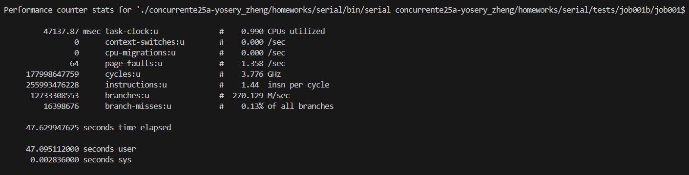
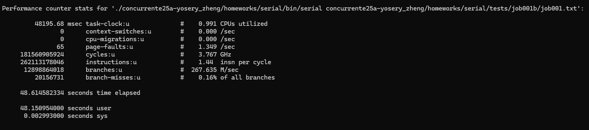
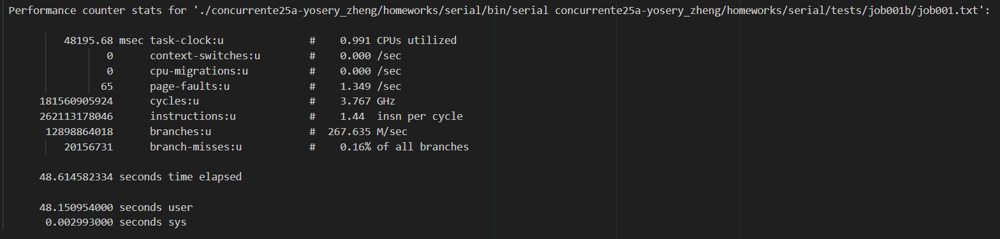
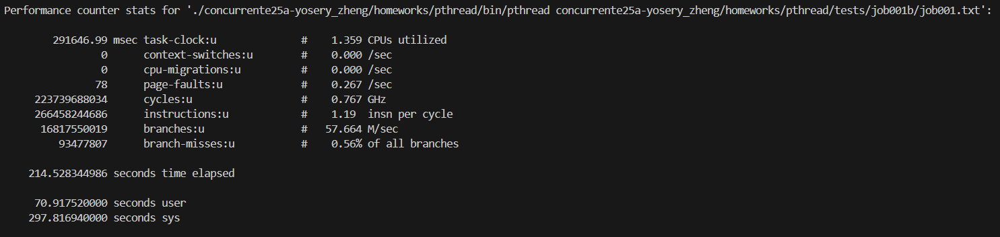
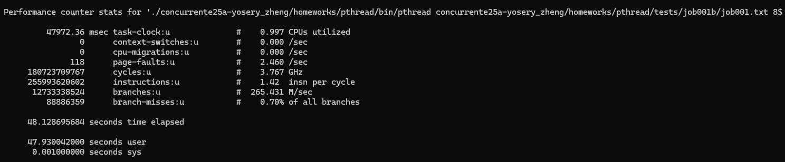
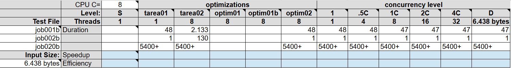
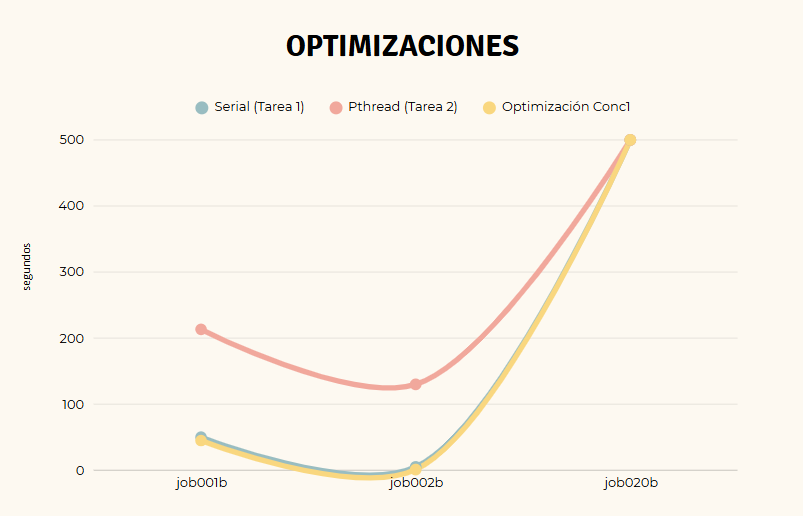
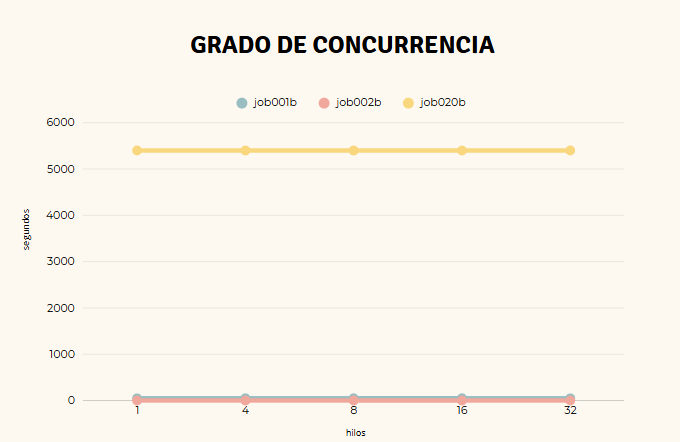

# Reporte de optimizaciones
Las duraciones reportadas fueron la más rápida de tres ejecuciones diferentes en la misma máquina (clúster Poás) y el mismo caso de prueba (job001b). Las salidas de perf están en en el archivo [perf.txt](../auto_files/perf.txt). Otros archivos .out de corridas interesantes en kcachegrind se encuentran en la carpeta [auto_files](../auto_files/). Para correrlos, ejecute en su máquina `kcachegrind nombre.out`, sin embargo, no es muy necesario ya que para efectos del presente reporte, se adjuntan pantallazos relevantes que se encuentran en la carpeta [img](../img/).

## Tabla de contenidos

- [Optimizaciones seriales](#optimizaciones-seriales)
  - [Versión serial original (Tarea01)](#versión-serial-original-tarea01)
  - [Iteración 1](#iteración-1)
  - [Iteración 2](#iteración-2)
- [Optimizaciones concurrentes](#optimizaciones-concurrentes)
  - [Versión concurrente inicial (Tarea02)](#versión-concurrente-inicial-tarea02)
  - [Iteración 1](#iteración-1-1)
- [Comparación de optimizaciones](#comparación-de-optimizaciones)
- [Comparación del grado de concurrencia](#comparación-del-grado-de-concurrencia)

## Optimizaciones seriales

| Iter. | Etiqueta  | Duración (s) | _Speedup_ | Descripción corta                        |
|-------|-----------|--------------|-----------|------------------------------------------|
| 0     | Serial0   | 47.629947625 | 1.00      | Versión serial inicial (Tarea01)         |
| 1     | Serial1   | 48.614582334 | 0.98      | Usa el path completo, no el relativo (Versión final serial) |
| 2     | Serial2   | 49.283765940 | 0.96      | Omite bordes a la hora de recorrer la matriz |

### Versión serial original (Tarea01)

Lo que hace el programa en su forma serial es leer el archivo job###.txt, crear el objeto plate, y simular la transferencia de calor por cada plate creado. La simulación se ejecuta celda por celda, lo cual ralentiza mucho el tiempo de ejecución si es una matriz grande. Luego, por ser serial, tiene que repetir todo el proceso anteriormente mencionado por cada línea que existe del job###.txt.

Un aspecto a optimizar podría ser disminuir la cantidad de celdas a recorrer en la matriz de la simulación, ya que si la celda es un borde, puede ser ignorada porque su temperatura no cambia debido a que se le inyecta calor. En esta versión, la simulación recorre absolutamente todas las celdas de la matriz, bordes incluidos, y cuando verifica que es un borde, la ignora.

Otro aspecto a considerar son los paths. El programa para saber cuál es la ruta a escribir en el archivo job###.txt, calcula el path de manera relativa en cada plate en vez de hacerlo sólo una vez al principio del programa o usando el path completo que viene del input del usuario.

Perf para el serial en job001b

Kcachegrind para el serial job001b
[link](../auto_files/callgrind.out.3136474)

Según kcachegrind, el proceso que dura casi el 100% es el run, y en el run reporta que el proceso que dura más es la simulación a la hora de copiar la matriz.

### Iteración 1

Se modifica el método de leer plate para que acepte el parámetro del input del usuario. La ruta que se usa es exactamente la que el usuario ingresa en vez de la ruta relativa en la que se encuentra en la terminal. No hubo speedup e incluso fue levemente más lento, aunque probablemente se deba a discrepancias del procesador. Aunque a nivel de tiempo de ejecución parece un fracaso, a la larga es una buena optimización porque es flexible a que los archivos de prueba estén en diferentes directorios.

Perf para Serial1 en job001b

### Iteración 2

Una solución al recorrido a todas las celdas de la matriz durante la simulación, podría ser darle un rango a la matriz para que sólo recorra "no_bordes". Para plates pequeños, no va a bajar mucho el tiempo de ejecución, de lo contrario, podría incluso ser más lento si la lógica para disminuir el rango a recorrer dura más que simplemente recorrer la celda borde e ignorarla. Pero, para matrices más grandes, donde hay una cantidad considerable de celdas borde, sí podría disminuir el tiempo de ejecución. En general, sí es una solución más eficiente ya que entre más grande se haga el problema, más tiempo ahorra.

Para implementarlo, se recorre la matriz de temperaturas original dos veces, una para las columnas y otra para las filas. Cuando encuentra los bordes, lo copia a la matriz de temperaturas temporales para que dentro de la simulación, las celdas adyacentes a los bordes puedan ser procesadas con la temperatura inyectada. Sin embargo, debido a que en cada iteración se copia toda la matriz de temperaturas temporales a la de temperaturas originales, es necesario copiar las temperaturas de los bordes en cada iteración también, lo cual no es eficiente debido a que se estaría recorriendo la matriz 3 veces (filas, columnas, simulación) a diferencia del programa original, que sólo la recorre una vez en la simulación y si encuentra borde, simplemente le copia la temperatura y la ignora.

Esta optimización se puede considerar un fracaso, sin embargo, en el futuro, sí se podría retomar la idea si se pretende optimizar la copia de matrices.

Perf para Serial2 en job001b

## Optimizaciones concurrentes

| Iter. | Etiqueta  | Duración (s) | _Speedup_ | Eficiencia | Descripción corta                      |
|-------|-----------|--------------|-----------|------------|----------------------------------------|
| -     | SerialI   | 48.614582334 | 1.00      | 1.00       | Versión serial final                   |
| 1     | Conc0     | 213.318203812| 0.23      | 0.06       | Versión concurrente inicial (Tarea02)  |
| 2     | Conc1     | 48.128695684 | 1.01      | 0.13       | Paraleliza los plates, no la matriz    |

### Versión concurrente inicial (Tarea02)

La optimización concurrente que se le hizo a la versión serial fue introducirle hilos al bucle que simula la transferencia de calor. Para hacer el bucle _thread safe_, se dividió la matriz de temperaturas en particiones. Sin embargo, para poder terminar una iteración, se ocupa de todas las diferentes particiones para saber si hubo un cambio máximo diferente para poder compararlo con epsilon y saber si terminar la simulación o no. Con el fin de comunicar las diferentes partes de la matriz de temperaturas, los hilos deben esperar a que todos los hilos se terminen, ser destruidos y vueltos a crear por cada iteración. En plates grandes resulta ser muy ineficiente, ya que entre más iteraciones, más lento se vuelve. Otra observación es la cantidad de hilos. Entre más hilos se utilicen, más lento se vuelve debido a que son más procesos que causan esperas, las cuales se vuelven cuellos de botella.

Para optimizar la tarea 2, aparte de lo obvio, lo cual sería orientarse a bajar el tiempo de espera entre hilos, es intentar otro tipo de concurrencia. En vez de usar hilos para el bucle de simulación, que prueba ser más rápido de forma serial, es usarlos en los diferentes plates. Entonces, cada línea del archivo job###.txt es procesado de manera paralela.

Perf para versión concurrente (tarea 2) en job001b

Kcachegrind para el concurrente (tarea 2) en job001b
[link](../auto_files/callgrind.out.2209469)

Se puede ver del reporte que lo que más se dura haciendo es creando los hilos por cada iteración de la simulación. Por lo que una optimización interesante sería orientada a la creación y destrucción repetitiva de los hilos.

Con un sólo hilo el reporte de kcachegrind da casi igual. Sin embargo, se le corre perf para sacar el speedup.   

### Iteración 1

Lo que se pretende optimizar es asignar un hilo por cada línea del job###.txt e ir procesando los plates de manera concurrente, sin embargo, podría no funcionar tan bien porque hay plates más grandes que otros, causando que algunos hilos terminen su ejecución temprano, sean desperdiciados y un solo hilo sea el encargado de ejecutar un plate grande. 

Perf para versión concurrente (tarea 2) en job001b

Aumentó el speedup por un poco, pero sigue sin ser eficiente. El tiempo de ejecución de esta versión paralela es más rápida que la versión serial, sin embargo, debido a que se están usando hilos, se esperaría aún más velocidad que no está sucediendo.

### Comparación de optimizaciones
En la siguiente tabla, la parte relevante es el lado izquierdo.

Cabe destacar que en la ejecución de la tarea 2, en el caso de prueba job001b, sale el número dos mil ciento treinta y tres. La confusión se debe a problemas de formato con Excel. También, en los datos en los que sale 5400+ significa que superaron el límite de tiempo de ejecución por el clúster Poás, el cual es una hora y media, o bien, cinco mil cuatrocientos segundos.  

  
En el gráfico, por temas de presentación, se acotó el eje Y a 500. Cabe recalcar que todos los tiempos de ejecución del caso de prueba job020b fueron terminados por el clúster Poás, por lo que todos terminan en más de 5400 segundos.

Por otro lado, se puede apreciar que la optimización concurrente es levemente más rápida que la versión final serial. La tarea 2 tiene un tiempo de ejecución más elevado debido a las consecuencias de una mala paralelización.

### Comparación del grado de concurrencia
En la siguiente tabla, la parte relevante es el lado derecho.
  
  
Se puede observar que la cantidad de hilos no afecta demasiado al tiempo de ejecución y lo anterior puede ser debido a que la eficiencia no está cerca de 1. Sin embargo, no es 0 tampoco, por lo que con más hilos sí se ejecuta en menos tiempo. El caso más interesante hubiera sido job020b, sin embargo, por el timeout del clúster, no se logró recolectar datos.