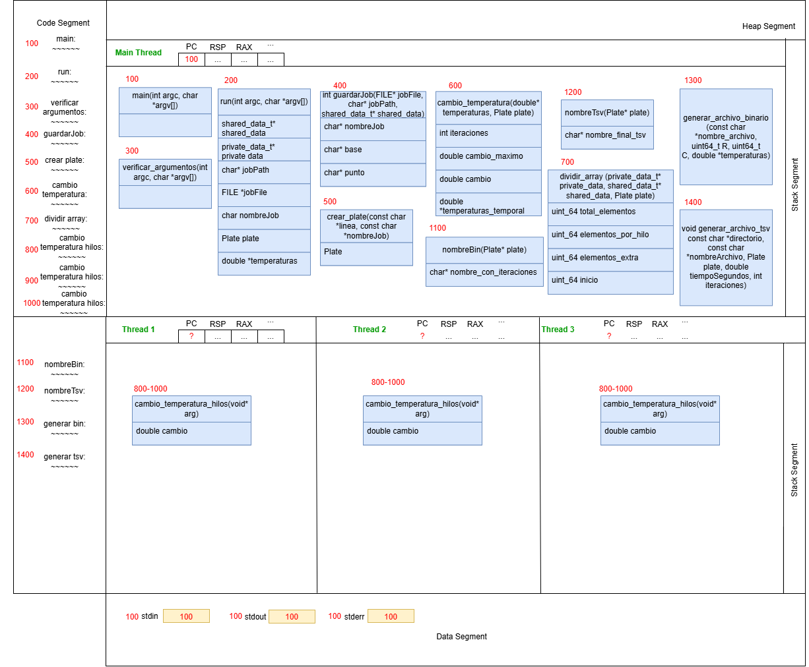

# Mapa de Memoria

# Diagrama de Clases (UML)

# Duraciones
| # hilos | minutos| 
| --- | --- | 
| 12 | 23 | 
| 4 | 6 | 
| 1 | 3 |

Hay un cuello de botella en la simulación. Se necesita hacer un pthread_join para poder comparar el cambio máximo global y decidir si hacer otra iteración o no.